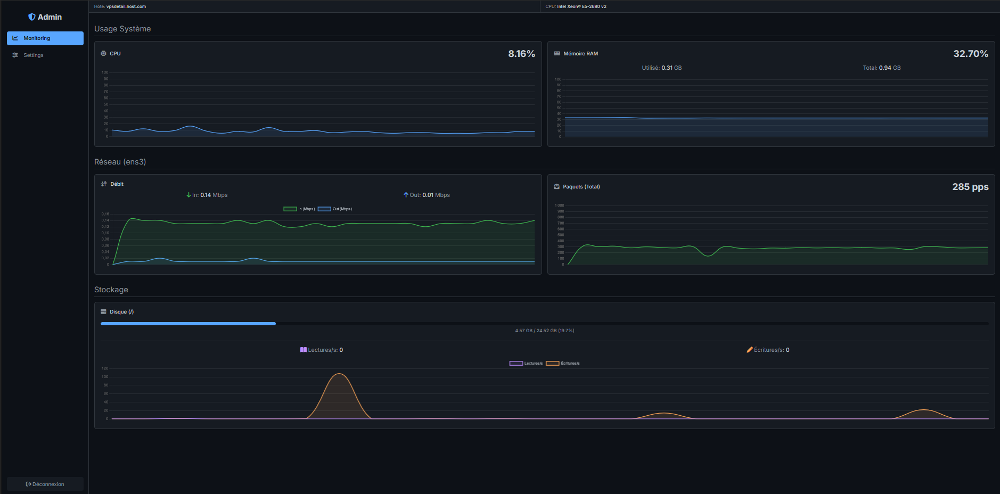

# 📊 Real-time System & Network Dashboard

> 🧠 **Educational project** – Real-time monitoring dashboard for system & network stats, with Discord webhook alerts.

---

## 🚀 Features

- 📈 **Live system metrics** – CPU, RAM, Disk, Network
- 🧪 **Packet-accurate bandwidth** – Real-time PPS & Mbps using `tcpdump`
- 🔐 **Password-protected dashboard** with auto session expiration
- 🚨 **Alert system** – Discord webhooks for alerts & recoveries
- 🎛️ **Web interface** for setting thresholds
- 📊 **Clean UI** with dynamic charts (Chart.js)

---

## 🧰 Tech Stack

- **Backend**: Node.js, Express.js, Socket.IO  
- **Frontend**: HTML, CSS, JS (vanilla), Chart.js  
- **System Tools**: `systeminformation`, `tcpdump`, `os-utils`, `axios`

---

## ⚙️ Prerequisites

Run these commands **on a Linux server**:

# 1. Install NVM & Node.js
curl -o- https://raw.githubusercontent.com/nvm-sh/nvm/v0.39.7/install.sh | bash
source ~/.bashrc
nvm install --lts

# 2. Install tcpdump
sudo apt update && sudo apt install -y tcpdump

# 3. Check installations
node -v && npm -v && tcpdump --version

---

## 📦 Install & Run

# Clone the repo
git clone https://github.com/Fyrisq/monitoring-panel.git

# Enter directory
cd your-repository-name

# Install dependencies
npm install

# Start server (requires root for tcpdump)
sudo node server.js

🖥️ Open `http://<your_server_ip>:3000` in your browser.

---

## 🔐 Dashboard Access

* **Default password**: `4555465`
* Change it in `server.js` (`PASSWORD` constant near top)

⏳ Sessions auto-expire after 15 minutes.

---

## 🔔 Webhook Alerts

Configure from the dashboard:

1. Click **Settings**
2. Paste your **Discord webhook URL**
3. Set thresholds (CPU, RAM, Net In/Out)
4. Save ✅

💾 Saved in `settings.json` (auto-loaded on reboot).

---

## 🧪 Example Screenshot

---

## 🛡️ License

MIT – Free to use, modify, and share for **educational** purposes.
⚠️ **Not recommended for production as-is** (uses `sudo` + root privileges)

---

## 🤝 Contributions

Pull requests, feedback, or forks are always welcome!

---

